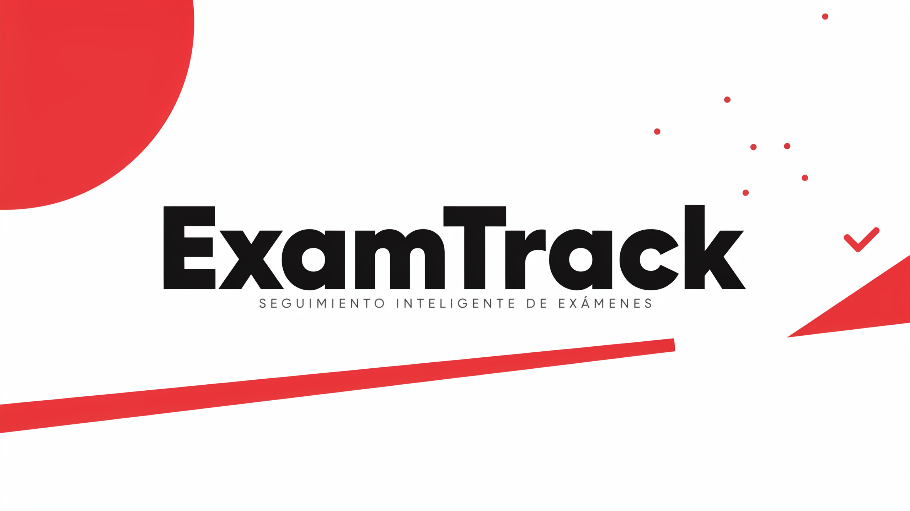

# ExamTrack

ExamTrack es una aplicación web enfocada en la gestión de convocatorias de exámenes, alumnados participantes y resultados académicos. Este proyecto proporciona una solución integral para llevar el control del entorno educativo, facilitando las tareas de administración y docencia.

## Arquitectura y Tecnologías

El proyecto está desarrollado bajo el ecosistema de Spring y Java, estructurado mediante el patrón Modelo-Vista-Controlador (MVC). Las tecnologías principales empleadas en el sistema son:

* Java 21: Lenguaje de programación base.
* Spring Boot: Framework principal para la configuración y el despliegue del servidor.
* Spring Web MVC: Manejo de peticiones HTTP y enrutamiento.
* Spring Security: Gestión integral de la autenticación, autorización y protección de rutas.
* Spring Data JPA (Hibernate): Persistencia de datos y mapeo objeto-relacional (ORM).
* Thymeleaf: Motor de plantillas del lado del servidor para la renderización de las vistas dinámicas HTML.
* Lombok: Reducción de código repetitivo (generación de constructores, getters, setters, etc.).
* H2 Database: Base de datos relacional integrada.
* Maven: Gestión de dependencias y construcción del proyecto.

## Configuración y Despliegue

La aplicación se encuentra configurada para su ejecución directa en entornos locales. Los parámetros de red y almacenamiento son los siguientes:

* Puerto del servidor: La aplicación escucha por defecto en el puerto 9000 (accesible mediante http://localhost:9000).
* Base de datos: Emplea una base de datos H2 con almacenamiento local en la ruta del proyecto (`./db/examTrackDB`).
* Consola de Base de Datos: La consola de administración de H2 está habilitada en el entorno de desarrollo. Sus credenciales directas son usuario `admin` y contraseña `123`.

## Datos de Prueba e Inicialización

Para facilitar la evaluación y prueba inmediata de las funcionalidades del sistema, el programa cuenta con una clase de inicialización de datos que se ejecuta automáticamente al levantar el servidor. 

### Cuentas de Acceso al Sistema

Se proporcionan los siguientes usuarios principales para poder ingresar a la plataforma y explorar los distintos perfiles de permisos:

* Perfil Profesor:
  * Usuario: user@user.com (referido comúnmente como user@user)
  * Contraseña: user

* Perfil Administrador:
  * Usuario: admin@admin.com (admin)
  * Contraseña: admin

### Entorno y Datos de Prueba

El programa incluye una instancia con **20 alumnos** de prueba preconfigurados para testear la asignación de notas, seguimiento académico y la correcta visualización de listados en la interfaz web, permitiendo operar con un volumen de datos realista desde el primer momento.

Además, el entorno cuenta con **10 departamentos** y **10 especialidades** ya inicializados para facilitar la navegación y la asociación con el profesorado y alumnado.

## Ejecución

Para iniciar la aplicación, compile el proyecto utilizando Maven y ejecute la clase principal correspondiente a la aplicación de Spring Boot. Una vez que el registro de inicio confirme el despliegue del servidor web, abra su navegador web y diríjase a la URL local configurada.

## Funcionalidades Principales

El sistema ExamTrack permite realizar de forma sencilla las siguientes operaciones:

* **Gestión de Usuarios y Roles:** Control de acceso y permisos diferenciados entre Administrador y Profesor.
* **Administración de Departamentos y Especialidades:** Organización del centro educativo mediante la creación y asignación de departamentos y especialidades.
* **Gestión de Profesorado:** Registro y administración de docentes, vinculándolos a sus respectivas áreas.
* **Gestión de Alumnado:** Mantenimiento del registro de alumnos, incluyendo su información personal, grupo y asignaturas matriculadas.
* **Convocatorias y Resultados:** Control de las pruebas de evaluación, registro de notas y seguimiento del rendimiento académico de los estudiantes.
